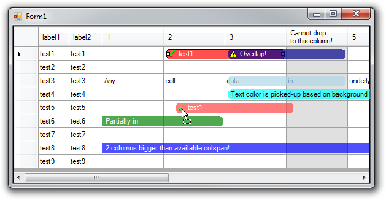
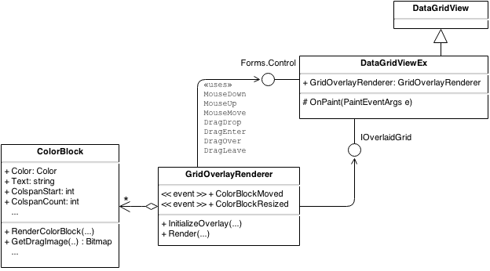

# Color Block Overlay for .NET DataGridView

Original article here:
https://www.codeproject.com/Tips/778645/Color-Block-Overlay-for-DataGridView

## Introduction
This component allows to overlay grid with colored blocks spanning across multiple columns. Color block is bound to a particular row through unique id and it is possible to resize/move these blocks. Hope this helps someone having similar requirements.

Implemented features:
* select
* resize: ability to validate resize operation + ColorBlockResized event with cancel support
* drag & drop: Per-cell granularity to allow/deny drop + ColorBlockMoved event with cancel support
* color blocks can overlap: Color block with biggest starting column will be drawn on top
* color blocks with colspan bigger than available area on grid
* text in color block
* scrolling with frozen columns
* sort/group operations of the underlying grid
* resizing columns
* image at the beginning of the block

## Using the Code
Diagram showing the component organization:

Overlay component is abstracted from the grid therefore, providing you can implement IOverlaidGrid interface which is the contact point with underlying grid, it is possible to integrate it with any grid. Originally, it was developed to use over different grid and only for the purpose of this tip, it was integrated with the standard .NET DataGridView. Integration of component can be done through inheritance or composition, in demo inheritance is used - DataGridViewEx. Main class handling color block rendering is GridOverlayRenderer. This class needs a reference to object implementing IOverlaidGrid and to control over which drawing is performed. It provides Render method which renders configured color blocks. In the example, this method is called in Paint event of DataGridViewEx. Color blocks can be configured via InitializeOverlay method of GridOverlayRenderer - see OnLoad in Form1. For further details, please refer to the attached source code.

## References
In the tip, I used the work of others. Here are references to the original articles:

* Drag & drop support library:  
http://blogs.msdn.com/b/adamroot/archive/2008/02/19/shell-style-drag-and-drop-in-net-part-2.aspx
* Round rectangle function:  
http://tech.pro/tutorial/656/csharp-creating-rounded-rectangles-using-a-graphics-path

## Dependencies:
.NET Framework 4
